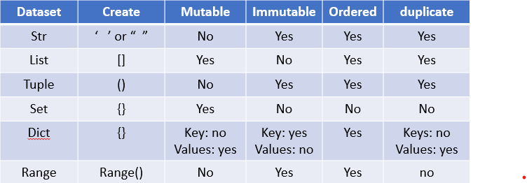

==========================================================================================
# Python
==========================================================================================
Python was designed and developed by Guido van Rossum in the year 1989, and the first version was released in the year 1991.


**1.** Python is a programming language used for app development

**2.** Python is a general-purpose, high-level, Case-Sensitive and Easy to Learn Programming Language

 _a)_ **General-purpose:**
* This means that Python is designed to be used for a wide variety of programming tasks, not just one specific domain. You can use Python for web development, data analysis, machine learning, automation, and much more.

 _b)_ **High-level:**
* Python is considered a high-level language because it is abstracted from the machine's hardware. This makes Python easier to read, write, and understand, compared to low-level languages (like Assembly or C), which are closer to machine code. In other words, Python lets you focus more on solving problems rather than managing memory or other low-level tasks.

 _c)_ **Case-sensitive:**
* Python treats uppercase and lowercase characters as different. For example, Variable and variable would be considered two different identifiers. This is important to remember when writing Python code, as the language will not automatically correct case mismatches

 _d)_ **Easy to Learn:**
* Python has a simple and easy-to-understand syntax, making it a great choice for beginners.


**3.** Python is simple and easy to learn, meaning it’s a straight forward language

**4.** Python is completely cross-platform or platform-independent

* Python is cross-platform, meaning you can write Python code on one operating system (e.g., Windows) and run it on another (e.g., macOS or Linux) without modifications, as long as Python is installed on that system.

**5.** Python is completely free and open-source

**6.** Python is an interpreted language 

 _a)_ **Compiler-based languages(e.g., C, C++, Java):** 

* &nbsp; The source code is compiled into machine code (binary) before execution.
* &nbsp; In this language, compilation errors prevent the code from compiling.

 _b)_ **Interpreter-based languages** (e.g., Python): 

* The code is executed line by line, with each line being translated into machine code and executed on the fly.
* In this languages, all the debugging occurs at run-time.which makes debugging easier.

**7.** Python is a dynamically typed language, not a statically typed language

 _a)_ **Statically typed languages** (e.g., C, Java) require the programmer to specify the data type of variables at the time of 

```
      int a = 100
      The data type (int) must be declared explicitly
```

 _b)_ **Dynamically typed languages** (e.g., Python)* allow the data type to be inferred based on the assigned value. You don't need to declare the type explicitly, making the code simpler and more flexible
* dynamically: no need to spcify any data type at the time of decleration 

* **Ex:** variable name = value 

 ```
      var = 100 # Here, 'var' is dynamically typed as an integer.
      print(var)
      print(type(var))

```

==========================================================================================
### Features of Python:
==========================================================================================

**Expressive Language:** Python code is readable and concise, allowing developers to write fewer lines of code for complex tasks.

**Free and Open Source:** Python is free to use, and its source code is available for modification and redistribution under the Python Software Foundation License.

**Cross-Platform/Platform Independent:** Python code can be run on any operating system without modification, making it highly portable.

**Object-Oriented Language:** Python supports object-oriented programming (OOP), which enables code reuse, modularity, and encapsulation for better security and maintainability.

**Huge Standard Libraries:** Python comes with a comprehensive standard library that provides many modules and functions for various tasks, such as file I/O, web development, data manipulation, etc.

**GUI Support:** Python supports graphical user interface (GUI) development with frameworks like Tkinter, PyQt, and Kivy.

**Portable:** Python programs can be easily migrated from one platform to another (e.g., from Windows to Linux or Mac) without changes.

**Extensible:** Python allows developers to integrate other languages like C/C++ for performance-critical parts, and it supports the use of external libraries and modules.


==========================================================================================
### Application Areas of Python:
==========================================================================================

**Standalone or Desktop Applications**
* CUI (Command User Interface) run directly on a user's computer
* GUI (Graphical User Interface) interact with the user via text in the terminal or command line

**Web Applications**
* Frameworks like Django and Flask enable Python for web development.

**Network-Based Applications**
* Python is used for building networked applications and protocols.

**Data Analysis Applications**
* Python, with libraries like Pandas, NumPy, and Matplotlib, is widely used in data analysis.These libraries allow you to work with large datasets, perform calculations, and generate charts.

**Business Applications**
* Python is used for building business applications, including ERP (Enterprise Resource Planning) systems and CRM software.

**AWS (Amazon Web Services)**
* Python can be used with AWS SDK (Boto3) for cloud services automation.

**DevOps**
* Python is often employed in automation scripts, monitoring, and server management tasks in DevOps.

**MATLAB-like Applications**
* Python can be used for numerical computing, similar to MATLAB, with libraries like SciPy and SymPy.

**Artificial Intelligence (AI)**
* Python is widely used for AI and Machine Learning, with frameworks like TensorFlow, Keras, and PyTorch.

**Testing**
* Python is popular in software testing and automation with frameworks like unittest, pytest, and Selenium.

**Python File Extension:**
* The default extension for Python files is .py (e.g., test.py).


==========================================================================================
### Different Ways to Write and Execute Python Code:
==========================================================================================

**Interactive Mode**
* You can run Python code interactively in the Python shell (REPL(Read-Eval-Print Loop)).

**Script Mode**
* You can write Python code in a file (e.g., test.py) and execute it via the command prompt:

**Using Python IDLE**
* Python's Integrated Development and Learning Environment (IDLE(Integrated Development and Learning Environment)) is a simple environment to write and run Python code.

**Using PyCharm Editor**
* PyCharm is a popular Python IDE for professional developers.
* You can download PyCharm Community Edition here.
* download PyCharm Community Edition : https://www.jetbrains.com/pycharm/download/?section=windows


==========================================================================================
### Python Fundamentals
==========================================================================================

**1. Comments** 
* &nbsp;Python are identified with a hash symbol(#), and extend to the end of the line# 
* &nbsp;short cut key is ctrl+/ : description about the code we can use # also

**2. Keywords or Reserved Words**
* &nbsp;There are fewer restrictions on their usage. For example, you will get a “SyntaxError” if you try assigning a keyword to a variable
* &nbsp;Python keywords are special reserved words that have specific meanings and purposes and can’t be used for anything but those specific purposes. 
* &nbsp;These keywords are always available—you’ll never have to import them into your code.
* &nbsp;Python keywords are different from Python’s built-in functions and types.

``` 
      import keyword
      print(keyword.kwlist)
```
* 'if' is keyword, we can not use as variable

**3. Identifiers**
* &nbsp;Any name is called identifiers (variable name or function name or any other name)
* &nbsp;Python Identifier is the name we give to identify a variable, function, class, module or other object. 
* &nbsp;That means whenever we want to give an entity a name, that's called identifier.
   
    _a)_ lowercase or uppercase.

    _b)_ case-sensitive.

    _c)_ allow digits(0-9).

    _d)_ should not start with digit. wrong : 9acmarpu9  crroct : acmarpu9.

    _e)_ should not be two parts (if two parts use _) (emp id) (emp_id).

    _f)_ allow underscore (_).

    _g)_ if any identifier starts with underscore(_) then it is private.
 
    _h)_ no keywords or reserved words can be used as identifier.


**4. Variables**
* &nbsp;Variables as Containers: A variable is used to store data values. It holds information that can be used and manipulated throughout a program.
* &nbsp;Variables as Identifiers: A variable is also known as an identifier because it uniquely identifies the value or object it is storing. An identifier is simply a name given to a memory location where data is stored.
* &nbsp;Named Memory Location: In Python, when you assign a value to a variable, Python internally stores the value in a memory location, and the variable name points to that location. The name you assign to a variable acts as a reference to the data.
* &nbsp;No Need to Specify Data Type: Unlike many other programming languages, Python is dynamically typed, meaning you don't need to specify the type of data a variable will hold.

**5. Multiple Assignment**
* &nbsp;is process of assigning a single value to multiple variables
* &nbsp;is process of assigning a multiple values to multiple variables

```  
      a =b =c =10
      print(a)
      print(b)
      print(c)
      print(type(a))
```

* &nbsp;Single line print

```
      a =b =c =10
      print(a,b,c, sep=",") # sep = separate with ,
      print(a,b,c, sep=",", end=".")
      print(type(a))
      10,10,10. <class 'int'> # O
```

* &nbsp; the process of assigning multiple values ot multiple variables

```
      a,b,c = 10,20,30
      print(a)
      print(b)
      print(c)
      print(a,b,c)
      print(a, end=",")
      print(b, end=",")
      print(c)
```

**6. Python Indentation**
* Python uses indentation (whitespace before a statement) to define the structure of the code, such as loops, conditionals, functions, and classes. Instead of using curly braces {} (like in many other languages such as C or Java), Python relies on consistent indentation to group statements within a block of code. 

* Indentation Rules:
   * 4 spaces: The Python style guide (PEP 8((Python Enhancement Proposal 8))) recommends using 4 spaces for each level of indentation.
   * Consistency: You can technically use a different number of spaces (like 1 or 2), but mixing different indentation styles (e.g., 4 spaces and tabs) will cause errors.
   * Tab vs Space: Although spaces are preferred, you can use tabs. However, using spaces is the common practice. Python 3 will raise a TabError if you mix tabs and spaces within the same block.

```
#In Java

   i = 10
   if (i=10)
   {
   s.o.p("true"); # System.out.print
   }
   else
   {
   s.o.p("false");
   }
```

```
# In Python


   i = 10
   if i ==10:
      print("true") # *indent by four spaces = 1 level*

   else:
       print("false") # *indent by four spaces = 1 level*
```

   


==========================================================================================
# Data types in python
==========================================================================================
* Python Data Types are used to define the type of a variable.
* Data types define the type of value a variable holds, and they also determine what operations can be performed on that value.
* In Python, data types are used to represent different types of values (e.g., numbers, strings, etc.) that are stored in variables.
* Python Data types are the classification or categorization of data items. It represents the kind of value that tells what operations can be performed on a particular data. 

**Mutable:** Data types whose values can be changed after they are created.

**Immutable:** Data types whose values cannot be changed after they are created.


| **Data Types**  |    **Type**        | **value**          | Description
| -------------   | -------------      |-------------       |------------- 
| **None**        | (NoneType)         | a = 'none'         |nothing is there in the variable
| **(Numeric)**   | (*int(Integers)*)  |float[1.0]          |holds numeric values
                                       |bool[true and false]|
                                       |Complex Numbers(1a) |


* **_Basic Data Types_**

1. **None**       (NoneType) -- a = 'none'

2. **(Numeric)**  (*int(Integers)*) -- float[1.0], bool[true and false],Complex Numbers(1a) -- holds numeric values

* **_Sequence Types_**

3. **(string)**   (Text Type)       -- holds textual data                      '' or ''' ''' or "" or""" """ 

4. **[list]**     (Sequence Types)  -- holds a variety of different data types [1, 2.5, "Hello", [1, 2, 3], True]

5. **(tuple)**    (Sequence Types)  -- holds collection of items               (1, 2.5, "Hello")

6. **(range)**    (Sequence Types)  -- holds often used in loops.               range(5)

7. **{set}**      (Set Types)       -- holds collection of unique items         {1, 2, 3, 4}

8. **dist**       (Mapping Type)    -- holds data in key-value pair form        {"key1": "value1", "key2": "value2"}

9. **bytes**      (Binary Types)    -- Immutable sequence of bytes              b'Hello'

10. **bytearray** (Binary Types)    -- Mutable sequence of bytes                bytearray(b'Hello').

11. **forzenset** (Set Types)       -- Similar to a set,immutable               frozenset([1, 2, 3])   


| Left-Aligned  | Center Aligned  | Right Aligned |
| :------------ |:---------------:| -----:|
| col 3 is      | some wordy text | $1600 |
| col 2 is      | centered        |   $12 |
| zebra stripes | are neat        |    $1 |

| First Header  | Second Header |
| ------------- | ------------- |
| Content Cell  | Content Cell  |
| Content Cell  | Content Cell  |


#### 1. none
* nothing is there in the variable
 ```     
      a = 'none'
      print('none')
      print(a)
      print(type(a))
```
**2. Numeric type**
* Numeric -- init(0,100),float(10.0),bool(true or false),Complex Numbers(1a)
```      
      a = 10
      print(a)
      print(type(a))

      a = 10.9
      print(a)
      print(type(a))
```

* int to flot convert*
```      
      a = 10
      print(a)
      print(type(a))


      b = float(a)
      print(b)
      print(type(b))
```

**Enter runtime** - when you enter a value at runtime using input() function the default datatype is *string*

* #Examples
```
      a = input("enter num1:")
      print(type(a))
      x = int(a)
      print(type(x))
```

* #Examples
```
      a = input("enter number1:")
      print(a)
      print(type(a))
      x = int(a)  #here we converting str to int
      print(x)
      print(type(x))

      b = input("enter number2:")
      print(b)
      print(type(b))
      y = int(b)  #here we converting str to int
      print(type(y))
      
      c = x+y
      print("sum c is", c)
```    
**-------another way------**

* #Examples
```
      a = int(input("Enter num1:"))
      b = int(input("enter num2:"))
      c = a + b
      print("sum is:", c)
```
* #Examples
```
      a = float(input("Enter num1:"))
      b = float(input("enter num2:")) 
      c = a + b
      print("sum is:", c)
```
* bool = true or false
```      
      a = 10
      b = 20
      c = a > b
      print(c)
```

====================================================================================
### Sequence Datatypes or data structure**

### 3. String(immutable)
====================================================================================
   * In Python, strings are an essential part of the language used to represent textual data. 
   * String Definition: A string is a sequence of characters enclosed in either single quotes (' ') or double quotes (" ").
      * Example: 'hello', "world"
   * String Methods: Python provides a variety of built-in methods to perform operations on strings. Some of these include methods like replace(), split(), lower(), upper(), and many more.
   * String Immutability: Strings in Python are immutable, meaning once a string is created, it cannot be modified. Operations like replace() or string concatenation will create new strings rather than modifying the original string.

   
* #Examples
  
 
* with '' 
      
      s = 'hello ashoka's'
      print(s)           # Output: hello ashoka
      print(type(s))     # Output: <class 'str'>

      s = 'hello ashoka\'s'
      print(s)           # add \ for print
      print(type(s))     # Output: <class 'str'>


* with ""

      s = "hello ashoka" 
      print(s)           # Output: hello ashoka
      print(type(s))     # Output: <class 'str'>


*Replacing 'hello' with 'hai' (note this does not change s, since strings are immutable)*
      
      s.replace("hello", "hai")
      print(s)           # Output: hello ashoka (s is unchanged)

*The replace method returns a new string, we can assign the result to a variable*
*we can not reuse "s" value*

      print(s.replace("hello","hai")) 

*We can assign the modified string to a new variable*
      
      s1 = s.replace("hello", "hai")
      print(s1)          # Output: hai ashoka

**To get a list of all available functions for string operations, you can use the dir() function:**
* This will return a list of all the methods and attributes associated with the string class.
      
      print(dir(str))
      __add_  #also called descriptors

   * description      
      
      help(str)

====================================================================================
**4. List[mutable]**
====================================================================================
   * A list in Python is an ordered collection that can hold a variety of different data types, including integers, floats, strings, and even other lists. Lists are enclosed in square brackets [] and elements are separated by commas.
   
*Key Features of Python Lists:*
   * **Ordered:** The items in a list have a specific order, and that order is preserved.
   * **Mutable:** Lists can be modified after creation. You can change, add, or remove elements.
   * **Heterogeneous:** Lists can store elements of different data types (e.g., integers, strings, booleans, etc.).
   * **Allow duplicates:** Lists allow duplicate elements, meaning the same value can appear multiple times in a list.
   

* Examples

   *Creating a list with various types of elements*
      
       l = [10,20,30,3.4,"ashoka",True]
       *Printing the list and its type*
       print(l)            # Output: [10, 20, 30, 3.4, 'att', True]
       print(type(l))      # Output: <class 'list'>

* Lists are mutable, which means we can change their elements. We can modify an element by accessing it using its index, or add elements using methods like append().
      
       l.append(33)        # Adds 33 to the end of the list
       print(l)            # Output: [10, 20, 30, 3.4, 'att', True, 33]

      *Modifying an element at a specific index*

       l[1] = 33           # Changes the element at index 1 (value 20) to 33
       print(l)            # Output: [10, 33, 30, 3.4, 'att', True, 33]


**Key Methods for Working with Lists:**
* **append(value)** — Adds an element to the end of the list.
* **insert(index, value)** — Inserts an element at a specific index in the list.
* **remove(value)** — Removes the first occurrence of the specified value.
* **pop(index)** — Removes the element at the specified index and returns it.
* **extend(iterable)** — Extends the list by appending all elements from another iterable (e.g., another list).
* **index(value)** — Returns the index of the first occurrence of the specified value.
* **sort()** — Sorts the list in ascending order. 


==========================================================================================
**5. Tuple(immutable)**
===========================================================================================
* A tuple is a built-in data structure in Python that is very similar to a list. However, unlike lists, tuples are immutable, which means their elements cannot be changed after creation.
   
   **Key Points:**
*  *Immutable:* Once a tuple is created, its elements cannot be modified, added, or removed.
*  *Ordered:* Like lists, tuples maintain the order of elements.
*  *Different Data Types:* A tuple can store elements of various data types (e.g., integers, strings, floats, etc.).
*  *Duplicates Allowed:* Tuples can have multiple occurrences of the same element.
*  *Parentheses:* Tuples are usually created using () (parentheses), though they are optional in some cases (e.g., creating a single element tuple requires a trailing comma).

* #Examples

   * tuple required multipile values*
   * The trailing comma is necessary to differentiate a tuple with one element from a regular value enclosed in parentheses.
   
      
      t = ("raj",)
      print(t)      # Output: ('raj',)
      print(type(t)) # Output: <class 'tuple'>
      
*Without the trailing comma, this is just a string enclosed in parentheses.*
      
      
      t = ("raj")  # This is a string, not a tuple
      print(t)  # Output: raj
      print(type(t))  # Output: <class 'str'>


      t = ("raj",12,23.4,10)
      print(t)
      print(type(t))
      t[1] = 33
      print(t)  # output t can not be changed


==========================================================================================
**6. Set{}**
===========================================================================================
* A set is an unordered collection of unique elements. This means that duplicate values are automatically removed when creating a set.

*Key Points:*
* *Unordered:* The elements in a set do not have any specific order. When you print a set, its elements may not appear in the order they were added.
* *Unique Elements:* Sets automatically remove duplicate elements, so each element is stored only once.
* *Mutable:* Sets are mutable, meaning you can add or remove elements after creation.
* *Different Data Types:* A set can hold elements of different data types (e.g., integers, strings, etc.).

*Creating Sets:*
* To create a non-empty set, you can use curly braces {}.
* To create an empty set, you need to use the set() function because {} creates an empty dictionary, not a set.
   
* #Examples
      
      s = set()
      print(s)          # Output: set()
      print(type(s))    # Output: <class 'set'>
   

      a = {10, 20, 30, 40, 50, 60}
      print(a)  # Output: {10, 20, 30, 40, 50, 60}
      print(type(a))  # Output: <class 'set'>


      a = {10, 10, 20, 30, 40, 50, 60, 60}
      print(a)  # Output: {10, 20, 30, 40, 50, 60}
      print(type(a))  # Output: <class 'set'>


* *Adding elements to a set:*
      
      a.add(70)  # Adds 70 to the set
      print(a)  # Output: {10, 20, 30, 40, 50, 60, 70}

* *Removing elements from a set:*

      a.remove(20)  # Removes 20 from the set
      print(a)  # Output: {10, 30, 40, 50, 60, 70}

* *Set operations like union, intersection, and difference are also commonly used:*
      
      b = {50, 60, 70, 80}
      print(a.union(b))  # Union: {10, 30, 40, 50, 60, 70, 80}
      print(a.intersection(b))  # Intersection: {50, 60, 70}
      print(a.difference(b))  # Difference: {10, 30, 40}

==========================================================================================
**7. Dictionary dict {}**
===========================================================================================
* A dictionary is an unordered collection of key-value pairs. It stores elements in pairs, where each key is associated with a value.

**Key Points:**

* **Ordered Collection:** As of Python 3.7+, dictionaries maintain the order of insertion, meaning the order in which you add key-value pairs is preserved.
* **Keys are Immutable:** The keys must be of immutable types (e.g., strings, numbers, tuples). You cannot use mutable types (like lists) as keys.
* **Unique Keys:** Dictionary keys must be unique. If you try to insert a duplicate key, it will update the existing key with the new value.
* **Mutable Values:** Values can be of any data type, and they do not need to be unique.
* **Creation:** You can create a dictionary using curly braces {} or by using the dict() constructor.
* *Creating a Dictionary:*
* **Empty dictionary:** Use {} or dict().
* **Non-empty dictionary:** Use curly braces {} with key-value pairs separated by a colon (:).
   
* #Examples

      d = {}
      print(d)       # Output: {}
      print(type(d)) # Output: <class 'dict'>


      capital_city = {'TS':'Hyd', 'AP':'AMV','TN':'CH'}
      print(capital_city)        # Output: {'TS': 'Hyd', 'AP': 'AMV', 'TN': 'CH'}
      print(capital_city['TS'])  # Output: Hyd
      print(capital_city['AP'])  # Output: AMV
   
  *Duplicate Keys:*

      capital_city = {'TS':'Hyd', 'TS':'AMV','TN':'CH'}
      print(capital_city)    # Output: {'TS': 'AMV', 'TN': 'CH'}


  *Modifying Dictionary Values:*

      capital_city = {'TS':'Hyd', 'TG':'HYD','TN':'CH'}
      print(capital_city)     # Output: {'TS': 'Hyd', 'TG': 'HYD', 'TN': 'CH'}
      
  *Changing values in a dictionary:*

      d = {1:'sai',2:'att'}
      print(d)         # Output: {1: 'sai', 2: 'att'}
      print(type(d))   # Output: <class 'dict'>
      d[2] = 'ramesh'  # Changing the value for key 2 
      print(d)         # Output: {1: 'sai', 2: 'ramesh'}

  
  *Adding key-value pairs at runtime:*
  *Get user input for key-value pairs*

      person = {}
      name = input("Enter person's name: ")
      age = int(input("Enter person's age: "))
      city = input("Enter person's city: ")

  *Add key-value pairs to the dictionary*
      
      person['name'] = name
      person['age'] = age
      person['city'] = city

      print("Dictionary after adding runtime values:", person)
      print(type(person))   # Output: <class 'dict'>


===========================================================================================
**8. range()**
========================================================================================
   * The range() function in Python is used to generate a sequence of numbers. It's typically used in for loops to iterate over a specific range of values.
   
**Key Points:**
* **1.Start, Stop, Step:**
   * *Start:* The number where the range begins (inclusive).
   * *Stop:* The number where the range ends (exclusive).
   * *Step:* The interval between each number in the range.
   * If the step is not specified, it defaults to 1.
   * If the start is not specified, it defaults to 0.

**Immutability:**
   * range() objects are immutable, meaning you cannot modify the values in a range once it’s created.

**Use Cases:**
   * The range() function is often used in loops (like for loops) to repeat actions a certain number of times.

* #Examples

      r = range(10)
      print(r)            # Output: range(0, 10)
      print(type(r))      # Output: <class 'range'>
      print(list(r))      # Output: [0, 1, 2, 3, 4, 5, 6, 7, 8, 9]
      print(type(r))      # Output: <class 'range'>

   * range(10) generates a sequence starting from 0 up to (but not including) 10.
   * We can convert it to a list using list(r) to see the actual values in the range.
   * range() itself does not store the sequence in memory; it generates the numbers on demand, which is why it shows as range(0, 10) when printed.
      
      r = range(2, 10, 2)  # start=2, stop=10, step=2
      print(tuple(r))      # Output: (2, 4, 6, 8)
      print(type(r))       # Output: <class 'range'>

   * range(2, 10, 2) starts from 2, goes up to (but not including) 10, and increments by 2 each time.
   * We can convert the range to a tuple to see the sequence of numbers: (2, 4, 6, 8).

     
      for i in range(5):
      print(i)


===========================================================================================
**9. bytes**
========================================================================================
   *the bytes data type represents sequences of bytes, which are immutable sequences of integers, each representing a byte value from 0 to 255

   #Examples

      b = bytes([65, 66, 67])  # ASCII values for 'A', 'B', 'C'
      print(b)  # Output: b'ABC'


===========================================================================================
**10. bytearray**
========================================================================================
   *In Python, bytearray is a mutable sequence of integers in the range 0 <= x <= 255. It is similar to bytes, but unlike bytes, bytearray objects can be modified after creation.


* #Examples

      ba = bytearray([65, 66, 67])  # ASCII values for 'A', 'B', 'C'
      print(ba)  # Output: bytearray(b'ABC')

===========================================================================================
**11. frozenset**
========================================================================================
   *frozenset is an immutable version of a set, which means once it is created, its elements cannot be changed or modified.

   #Examples

      frozen_set = frozenset([1, 2, 3, 4, 5])
      print(frozen_set)  # Output: frozenset({1, 2, 3, 4, 5})


%%%%%%%%%%%%%%%%%%%%%%%%%%%%%%%%%%%%%%%%%%%%%%%%%%%%%%%%%%%%%%%%%%%%%%%%%%%%%
# Operators
* In Python, operators are indeed symbols used to perform operations on variables and values. There are several types of operators in Python


%%%%%%%%%%%%%%%%%%%%%%%%%%%%%%%%%%%%%%%%%%%%%%%%%%%%%%%%%%%%%%%%%%%%%%%%%%%%%
**1. Arithmetic Operators:**


* These are used to perform mathematical operations like addition, subtraction, etc.

* + (Addition)
* - (Subtraction)
* * (Multiplication)
* / (Division)
* // (Floor Division)
* % (Modulus)
* ** (Exponentiation)


* #Example

   print(3+2)

%%%%%%%%%%%%%%%%%%%%%%%%%%%%%%%%%%%%%%%%%%%%%%%%%%%%%%%%%%%%%%%%%%%%%%%%%%%%%
**2. Relational(Comparison) Operators:**


* These operators are used to compare values.

* == (Equal to)
* != (Not equal to)
* > (Greater than)
* < (Less than)
* >= (Greater than or equal to)
* <= (Less than or equal to)

* #Example

      print(3 > 4)
      False

%%%%%%%%%%%%%%%%%%%%%%%%%%%%%%%%%%%%%%%%%%%%%%%%%%%%%%%%%%%%%%%%%%%%%%%%%%%%%
**3. Assignment operator**

* These are used to assign values to variables.

* = (Assign)
* += (Add and assign)
* -= (Subtract and assign)
* *= (Multiply and assign)
* /= (Divide and assign)
* //= -- floot div and assign
* **= -- power and assigan

* #Example
      a = 5  # Assigns 5 to variable 'a'
      print(a)  # Outputs: 5

      a += 2  # Equivalent to a = a + 2, adds 2 to 'a'
      print(a)  # Outputs: 7 (because 5 + 2 = 7)

      a -= 2  # Equivalent to a = a - 2, subtracts 2 from 'a'
      print(a)  # Outputs: 5 (because 7 - 2 = 5)

%%%%%%%%%%%%%%%%%%%%%%%%%%%%%%%%%%%%%%%%%%%%%%%%%%%%%%%%%%%%%%%%%%%%%%%%%%%%%
**4. logical operators**

* These are used to perform logical operations, usually for conditional statements.
* The and operator returns True if both conditions are true, otherwise it returns False.

* and (Logical AND)
* or (Logical OR)
* not (Logical NOT

    
* #Examples
   *The and operator returns True if both conditions are true, otherwise it returns False.*

      print(20 < 3 and 1 < 4)  
      #20 < 3 is False, 1 < 4 is True
      #So, False and True gives False
      #Output: False

   *The or operator returns True if at least one condition is true. If both are false, it returns False.*
   
      print(20 < 3 or 1 < 4)  
      #20 < 3 is False, 1 < 4 is True
      #So, False or True gives True
      #Output: True

   
   *The not operator reverses the boolean value of the condition: if the condition is True, it returns False, and if the condition is False, it returns True.*
 
      print(not(20 < 3))  
      #20 < 3 is False, so not False is True
      #Output: True

* #Additional Examples:

      #Using and
      x = 5
      y = 10
      print(x > 3 and y < 15)  # True and True = True
      #Output: True

      #Using or
      x = 5
      y = 10
      print(x < 3 or y > 5)  # False or True = True
      #Output: True

      #Using not
      x = 10
      print(not(x < 5))  # not False = True
      #Output: True


%%%%%%%%%%%%%%%%%%%%%%%%%%%%%%%%%%%%%%%%%%%%%%%%%%%%%%%%%%%%%%%%%%%%%%%%%%%%%
**5. Membership**

* These operators are really handy when checking if a value exists in a sequence like a list, tuple, string, or dictionary.
* in: Returns True if the value exists in the sequence.
* not in: Returns True if the value does not exist in the sequence

* #Examples
      #List example
      
      l = [10, 20, 30]

      *print(100 not in l)  # 100 is not in the list, so it returns True*
      #Output: True

      print(10 not in l)  # 10 is in the list, so it returns False
      #Output: False

      print(10 in l)  # 10 is in the list, so it returns True
      #Output: True

      #String example
      print("x" in "hyd")  # "x" is not in the string "hyd", so it returns False
      #Output: False


%%%%%%%%%%%%%%%%%%%%%%%%%%%%%%%%%%%%%%%%%%%%%%%%%%%%%%%%%%%%%%%%%%%%%%%%%%%%%
**6. identity**

* These are used to check whether the variables are having the same identity or not
* is: This operator checks if two variables refer to the same object in memory (i.e., they have the same identity).
* is not: This checks if two variables do not refer to the same object in memory.

* #Examples

      i = 10
      j = 20

      #Checking if i and j refer to the same object
      print(i is j)  # False, because i and j are pointing to different objects
      #Output: False

      #Checking if i and j do not refer to the same object
      
      print(i is not j)  # True, because i and j are pointing to different objects
      #Output: True

      #Using id() to get the memory address of the variables
      *id(): it is a built-in function*
      
      print(id(i))  # Unique memory address for i
      print(id(j))  # Unique memory address for j
   


      #Assigning same value to two variables
      
      x = [1, 2, 3]
      y = x  # y points to the same object as x

      #Checking if both x and y are the same object in memory

      print(x is y)  # True, because both refer to the same object in memory
      #Output: True

      #Checking the memory address of both variables
      
      print(id(x))  # Memory address of x
      print(id(y))  # Memory address of y


      a = [1, 2, 3]
      b = [1, 2, 3]  # A new list, even though it has the same values as a

      #Checking if a and b refer to the same object

      print(a is b)  # False, because they are different objects in memory even though the values are the same
      #Output: False

      #Checking if a and b do not refer to the same object

      print(a is not b)  # True, because a and b are different objects
      # Output:True

      #Memory addresses will be different for different objects
      
      print(id(a))  # Memory address of a
      print(id(b))  # Memory address of b

         

%%%%%%%%%%%%%%%%%%%%%%%%%%%%%%%%%%%%%%%%%%%%%%%%%%%%%%%%%%%%%%%%%%%%%%%%%%%%%
**7. Bitwise**

* Bitwise operators in Python perform operations on individual bits of integers

   bitwise AND(&)
   bitwise OR(|)
   bitwise XOR(^)
   bitwise NOT(~)
   bitwise left shift (<<)
   bitwise right shift (>>)
   
1. Bitwise AND (&)
* Compares each bit of two integers, returning 1 if both bits are 1, otherwise 0.
    
      a = 5  # 0101 in binary
      b = 3  # 0011 in binary
      result = a & b  # 0001 in binary, which is 1 in decimal
      print(result)  # Output: 1

2. Bitwise OR (|)
* Compares each bit of two integers, returning 1 if at least one of the bits is 1.

      a = 5  # 0101 in binary
      b = 3  # 0011 in binary
      result = a | b  # 0111 in binary, which is 7 in decimal
      print(result)  # Output: 7

3. Bitwise XOR (^)
* Compares each bit of two integers, returning 1 if the bits are different, otherwise 0.

      a = 5  # 0101 in binary
      b = 3  # 0011 in binary
      result = a ^ b  # 0110 in binary, which is 6 in decimal
      print(result)  # Output: 6

4. Bitwise NOT (~)
* Inverts all the bits of the integer, which is equivalent to -(n + 1) (two's complement form).

      a = 5  # 0101 in binary
      result = ~a  # Inverts bits: 1010 in binary, which is -6 in decimal
      print(result)  # Output: -6

5. Bitwise Left Shift (<<)
* Shifts the bits of the number to the left by a specified number of positions. Each shift to the left multiplies the number by 2.

      a = 5  # 0101 in binary
      result = a << 1  # Shift left by 1: 1010 in binary, which is 10 in decimal
      print(result)  # Output: 10

6. Bitwise Right Shift (>>)
* Shifts the bits of the number to the right by a specified number of positions. Each shift to the right divides the number by 2 (and truncates the result).  

      a = 5  # 0101 in binary
      result = a >> 1  # Shift right by 1: 0010 in binary, which is 2 in decimal
      print(result)  # Output: 2


*****************************************************************************************
# **Control Flow Statement**
*****************************************************************************************
* In Python, conditional statements are used to execute certain blocks of code based on whether a condition is true or false. These statements allow your program to make decisions and change its behavior accordingly.
* Python control flow. Control flow is the order in which individual statements, instructions, or function calls are executed or evaluated.
* Control FLow Statement are used to mantin flow of program execution
 
   Conditional statements
      if 
      if else
      nested if
      elif
   
   iteretive statement
      for
      whle
   
   transfer statements
      break
      continue
      pass

      
*****************************************************************************************
**1. Conditional statements**
*****************************************************************************************
    *if  
    *if else 
    *nested if 
    *elif 
    
      
**if & if else**
* *if* is key word test the specific condition
* if else --The if-else statement allows you to execute one block of code if the condition is true and another block of code if the condition is false
* The if statement evaluates a condition. If the condition is True, the code block within the if gets executed. If the condition is False, it will skip to the else block (if present).

* #Examples

      i = 10
      if i == 100:
         print("this is correct")  # This won't be printed because i is not 100
      else:
         print("this is not correct")  # This will be printed because i is 10, not 100

      i = 10
      if i == 100:
         pass   # nothing is there 
      else:
         print("this is not correct")  # This will be printed because i is 10, not 100
 
      i = int(input("Enter a number: "))  # Get user input as an integer
      if i % 2 == 0:  # Check if the number is divisible by 2
         print(i, "is even")
      else:
         print(i, "is odd")


      i = int(input("enter first number:"))
      j = int(input("enter second number:"))  
      if i > j:
          print(i,"is big")
      else
           print(j,"is big")  
-----------------------------------------------------------------
**nested if**
  * is test multipile conditions and one of the condition fail its jump into another if ) 
  * (if inside if) You can have if statements inside if statements, this is called nested if statements.

   #Examples
      i = int(input("enter first number:"))
      j = int(input("enter second number:"))
      k = int(input("enter third number:"))

      if i > j and i > k: #30 10 20
          print(i,"is big")
      else
           if j > k:
            print(j,"is big")
        else:
           print(k,"is big")
-----------------------------------------------------------------
   #Examples
      name = input("enter the name:")
      age = int(input("enter the age:"))
      gender = input("enter your geder (M/F):")

      if age>= 18:
      if gender == "M":
           print("Hello Mr.", name, "Welcome")
      else:
           print("Hello Mrs", name, "Welcome")

      else:
          print("You are not eligbile")

   #Examples
      var = 100
      or
      var = int(input("Enter the Expression value:")) #we can enter the runtime value 
      if var < 150:
          print("Expression value is less than 150")

          if var < 200:
              print("Expression value is less than 200")

              if var < 300:
                   print("Expression value is less than 300")
      else:
           print("could not fine the Expression value")
  
-----------------------------------------------------------------
**elif**
  * one of the confition is true other condition will not be test here

 
   #Examples
      var = 100
      or
      var = int(input("Enter the Expression value:")) #we can enter the runtime value
      if var < 150:
           print("Expression value is less than 150")
      elif var < 200:
          print("Expression value is less than 200")
      elif var < 300:
          print("Expression value is less than 300")
      else:
          print("invalid expression value")

   #Examples
      i = int(input("enter the number:"))
      if i == 1:
          print("one")
      elif i == 2:
          print("two")
      elif i == 3:
          print("three")
      elif i == 4:
          print("four")
      else:
          print("invalid number")


==========================================================================================================================================
**2. Iterative statements** or **loop Statement** or **Repetitive Statements**
==========================================================================================================================================
2 key words 
   1. for loop
      a) for loop statement
         for loop is used to itetate the iterator or range
         iterators -  list, set, tuple, dict, arry, string etc
          
      b) for repetitive statement
         while loop is repetitive statement or loop statement
         it will repet the certine block of code
         
      c) for iterative statement

   2. While loop

**for loop** 
   * use to iterate the elements of collections what the order they appear
   * A for loop is used for iterating over a sequence (that is either a list, a tuple, a dictionary, a set, or a string).

   a) for loop statement
         for loop is used to itetate the iterator or range
         iterators -  list, set, tuple, dict, arry, string etc

    
    for element in iterator :
              block of code

   for - keyward  [to create for loop]       element - Temporary variable [ to store a value of iterator for every iteration]

    for variablename in sequence:
        statements
        for variablename in sequence:
            statements

  #Examples
      
      list = [10,20,30,40,50,60]
      for element in list:
         print(element)

         
         
   #Examples
      
      list = [10,20,30,40,50,60]
      for i in list:
         print(i)

   #Examples

      l = [10,20,30,40,50]
      print(l[0])
      print(l[1])
      print(l[3])
      print(l[4])

   #Examples
       for i in range(50)
           print (att)
----------------------------------------------------
Another Way:-
      
   i is the loop variable
   L list collections
   here one by one value assigned to "i" 

   #Examples
      l = [10,20,30,40,50]
      for i in l:
          print(i) # Line by Line
    
      for i in l:
          print(i, end= " ") #single line
    
      for i in [10,20,30,40,50]:
         print(i)
    
      for i in "att":
         print(i)
        
       for i in range(10):
            print(i,end= " ")

      for i in range(10):
      for i in range(1,10,2):
          print(i,end="")

   #Examples
      for i in range(1,11):
      if i == 5 or i == 8:
         continue
      print(i, end="")
   
   #Examples
      for i in range(1,11):
      if i == 5 or i == 8:
         break  # Completley stop 
      print(i, end="")
-------------------------------------------------------------------------
   #Examples
      t = int(input("enter the table number:"))
      for i in range(1,21):
      print(t,"X",i,"=", t*i)
--------------------------------------------------------------------------

 **while** 
   use to execute the no of statements as long as the condition is true, 
   once the condition is false then the control will jump into out of the loop.
 
   *infinite* = no stop

    while condition:
       statement

   i = 1
    while i < 6:
      print(i)
      i += 1 # remember to increment i, or else the loop will continue forever.
--------------------------------------------------------------------------
   i = 1
    while i <= 10:
        print(i)
         i = i+1
===========================================================================================================================================
**3. transfer statement**
===========================================================================================================================================

   *break* is used to stope the iteratiosn based on the condition
   *continue* is used to skip the current iteration and it will continue with the next iteration
   *pass*

   for i in range(1,10):
        print(i,end= " ")
        if i == 5:
            break
---------------------------------------------------------
*this will skip only 5 and 8*
   for i in range(1,10):
       if i == 5 or i == 8:
            continue
        print(i, end=" ")

   for i in range(1,101):
       if i%2 != 0: # if i%2 == 0:
            continue
        print(i,end= " ")

----------------------------------------------------------------------------------------------------------

*nested for loop* a for loop which is having one more loop within is is called nested for loop


1. write a program to find the sum of first n mumbers using for loop and while loop?
   # n = int(input("Enter number:"))
   # s = 0
   # for i in range(1,n+1):
   #     s += i
   # print("the sum of first",n,"numbers:",s)

   n is the input type
   s is the result storage


2. take a number form user input print that number table?
   # n = int(input("Enter the number:"))
   # for i in range(1,11):
   #     print(n,"X",i,"=",n*i)


------------------------------------

String :=

1. what is string
   string is group of charrecters or sequence of charrecters

2. diffrent ways to create a string
   '', "", ''' ''', immutable

3. string indexing and string slicing
   string always starts with 0 index 
   slicing its part of the string
   # 0 1 2 3 4 5 6 7 8 # positive index
   # h y d e r a b a d
   # -9-8-7-6-5-4-3-2-1 # negitive index

   # s = "hyderabad"
   # print(s)
   # print(s[3])
   # print(s[-3])
   # print(s[1:6]) # slicing is print the 1 to 5 words in hyderabad
   # print(s[-7:-1]) # negitive slicing

4. String concatenation and string multiplication
   concatenation is it just process of adding 2 or more string into single string (+)
   multiplication is if you want to display the string number of repeted times  (*)
   # s1 = "durga"
   # s2 = "soft"
   # print(s1+s2)
   # print(s1+" "+s2)
   # print(s1*3)
   # print((s1+" "+s2+" ")*3)

5. String split and max split
   split just divied the string based on the separator
   max split how many times
   # s1 = "python is very easy and it is opp and it is interpreted"
   # print(s1)
   # s2 = s1.split(" ")
   # print(s2)
   # s2 = s1.split(" ",3)
   # s2 = s1.split("is")
   # print(s2)

6. string capitalize
   is used to return a new string where as capital letter 
   # s1 = "python is very easy and it is opp and it is interpreted"
   # print(s1)
   # s2 = s1.capitalize()
   # print(s2)
   # print(s1.capitalize())

7. String Titel
   only starting capitalize word
   # s1 = "python is very easy and it is opp and it is interpreted"
   # print(s1)
   # s2 = s1.title()
   # print(s2)

8. String count 
   it is used to return the number of ocurrences of substring form given string
   # s1 = "python is very easy and it is opp and it is interpreted"
   # print(s1)
   # print(s1.count('is'))
   # s2 = s1.count("a")
   # print(s2)

9. string replace
  # s1 = "python is very easy and it is opp and it is interpreted"
  # print(s1.replace("easy","hard"))
  # s2 = s1.replace("easy", "hard")
  # print(s2)

10. upper and lower
   # s1 = "python is very easy and it is opp and it is interpreted"
   # print(s1.upper())
   # s2 = s1.upper()
   # print(s2.lower())

11. string swapcase (caps change to small)
   # s = "DuRgAsOfT"
   # print(s)
   # print(s.swapcase())

12. string reverse
13. string immutable
14. string sort
   # s = "python is very easy"
   # s1 = s.split()
   # print(s1)
   # s1.sort()
   # print(s1)
   # s1.sort(reverse=True)
   # print(s1)

print even index and odd index position characters
# s = "durgasoft"
# print("Even index position characters:",s[0::2])
# print("odd index position characters:",s[1::2])

   
15 join function for the string

   # s = "durgasoft"
   # s1 = ':'.join(s)
   # print(s1)
   # s2 = ''.join(reversed(s1))
   # print(s2)
   # print("".join(reversed("SAI")))

   # l = ["sai", "raj","ram"]
   # s = ','.join(l)
   # print(s)


16. strip() 
   - it return a copyof the string with both leading and trailing characters removed
      leading = left side of the character
      trailing = right side of the character
       
17. lstrip()
   - return a copy of the string with leading characters removed

18. rstrip()     
   - Return a copy of the string with trailing characters removed
   
   # s = "  durga  "
   # print(s.strip("  "))
   # print(s.rstrip("  "))
   # print(s.lstrip("  "))
   # s1 = (s.strip("  "))
   # print(s1)

19. len(): it return length of the string
    # print(len(s))

20. Find() used to find substring from given string returns -1 if there is no substring
    # print(s.find("b"))
   
21. Max() highest alphabetical character in a string
22. min() lowest alphabeticalcharacter in astring
23. index() index of substring
    # print(s.index("b"))

24. rindex() highest index of substring
    # print(s.rindex(b))

25. partition() splits the string at the first occurrence of the separator and return a tuple
    # s = "python is very easy and it is opp and it is interpreted is"
    # print(s.split(" "))
    # print(s.partition(s))

26. startswith() return true if a string starts with the given prefix otherwise returns false

27. endwith() return true if a string ends with the given suffix otherwise returns False

28. isdigit() returns "True" if all characters in the string are digits,
    otherwise, it returns "False"

29. isalpha() return "True" if all characters in the string are alphabets Otherwise, it returns "False"

30. isalnum() returns true if all the characters

 Ex reveresed words
 # s = "python is very easy"
 # s1 = s.split(" ")
 # print(s1)
 # for i in s1:
 #     print(i[::-1],end=" ")

--------------------------------------------------------------------------------------------------
List : is order collection of elements
      heterogeneous elements (diffrent types of data types)

1. what is list
2. nested list (one or more list)
  # l = [ 10,20,[30],40,1.0 ]
  # print(l[2])
  # print(type(l))
3. creating a list

4. access elements from a list
5. list slicing (perticulear part of the string)
   # l = [10,20,[30],40,1.0]
   # print(l)
   # l[1] =33 # 1 is index and 33 is element
   # print(l)
   # l.insert(1,33) # 1 is index and 33 is value
   # print(l)

6. changing or adding elements to list
   # l = [10,20,[30],40,1.0]
   # print(l)
   # l.append(33) # last of the list and one element to the list
   # print(l)
   # l.extend([34,"sai",56]) # multipile elements to the list
   # print(l)

7. append and extend methods in list
8. inser method in list
9. list concatenation and multiplication
   # l1 = ["sai","manoj","jaideep"]
   # l2 = ["att","ms","tcs"]
   # l3 = l1+l2
   # print(l3)
   # print(l1*2)
10. delete or remove elements form a list
11. remove(), pop(), clear(), del
   # l = [10,20,30,40,60]
   # print(l)
   # l.remove(20) # elements
   # print(l)
   # l.pop(2) # index
   # print(l)
   # l.clear()
   # print(l)
   # del l
   # print(l)

12. list sort

   # l = [2,10,4,8,6,7,8]
   # print(l)
   # l.sort()
   # print(l)
   # l.sort(reverse=True)
   # print(l)
b b   
13. list copy
   shallow copy is normal copy

   deep copy
   # l = [2,10,4,8,6,7,8]
   # print(l)
   # l1 = l.copy()
   # print(l1)
   # l.append(33)
   # l1.remove(10)
   # print(l1)
   # print(l)
   
14. list count
  # l = [2,10,4,8,6,7,8,5,5,5,5]
  # print(l.count(5))
  
15. list index

16. creating list from user input values

   # creating list from user input value
   # l = []
   # v1 = int(input("Enter a integer value:"))
   # v2 = float(input("Enter a float value:"))
   # v3 = input("enter a string value:")
   # l.append(v1)
   # l.append(v2)
   # l.append(v3)
   # print(l)

17. creating list using range function
   # l = []
   # n = int(input("Enter the length of list:"))
   # for i in range(n):
   #     x = int(input("enter the element:"))
   #     l.append(x)
   # print(l)


   # l = []
   # n = int(input("Enter the length of list:"))
   # for i in range(n):
   #     x = input("enter the element:")
   #     l.append(x)
   # print(l)

# Creating list using range function
   # print(list(range(2,10,2)))

13--------------------------------------------------------------------------------------------------

Tuple:

1. what is tuple : is order collection of elements same as list
2. creating tuple : ()
3. creating tuple with one element : with ,
4. accessing elements from tuple
5. tuple slicing
6. tuple immutable
7. tuple concatenation and multiplication
   adding one or more tuples in to single concatenation
8. deleting a tuple
9. tuple methods --- count and index
10. tuple membershiptest
11. len(),max(),min(),sum()
12. converting a string into tuple
13. converting a list into tuple
14. converting a tuple into string
15. tuple packing and unpacking

---------------------------------------
Set:

1. what is set : unorder collection of unic elements and ignore duplicate elements
2. creating set 
   # s = set()
   # print(s)
   # print(type(s))

   # s = {10,20,30,"sai",34.5}
   # print(s)
   # s.add(99)
   # print(s)
   
3. creating an empty set
4. how to change set (add and update)
5. remove elements from set(discard and remove), clear(), del
6. set operation -- union (|)
                    intersection (&)
                    difference(-)
                    symmetric difference(^)
   # its return unique values
   # a = {1,2,3,4,5}
   # b = {4,5,6,7,8}
   # print(a|b)
   # print(a.union(b))

   # intersection
   # print(a&b)
   # print(a.intersection(b))

   # difference
   # print(a-b)
   # print(a.difference(b))

   # symmetric difference
   # common values will not print
   # print(a^b)
   # print(a.symmetric_difference(b))

7. membership test
8. len
9. max and min
10. sum

---------------------------------------

Dictionary:
-----------

1. what is dictionary : is a collection of items, 
                        each item can be pair {key:value}
                        keys are immutable, values are mutable
                        keys must be unique, no duplicate key
                        value not unique, duplicate values also possible
                        key can be any type
2. creating dictonary
3. accessing value from dictionary
4. change or add values
5. delete or remove values
6. copy
7. items
8. keys
9. values
10. membership test
11. len
12. pop
13. popitem

   bytes: is used to represent byte numers just like an array the only allowed values for bytes is0 to256
          bytes is immutable, we cannot change


   
      

   


